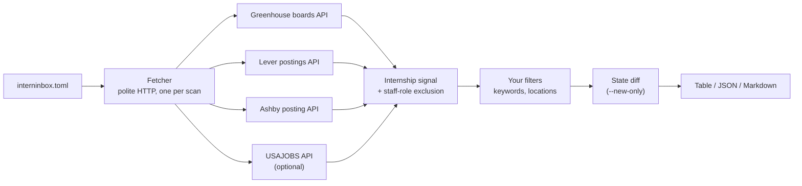

<div align="center">

# interninbox

**Find internships from your terminal.**

List your target companies once, then get every matching internship from their
public job boards, in one command, on your machine.

[](https://github.com/hiratinspace/interninbox/actions/workflows/ci.yml)
[](LICENSE)
[](pyproject.toml)
[](https://pypi.org/project/interninbox/)
[](#configuration)

</div>

```console
$ interninbox scan --new-only

COMPANY   TITLE                                   LOCATIONS       POSTED      URL
stripe    Software Engineering Intern (Summer)    New York, NY    2026-08-01  https://stripe.com/jobs/...
linear    Product Engineering Intern              Remote          2026-07-28  https://jobs.ashbyhq.com/linear/...
plaid     Data Science Intern                     San Francisco   -           https://jobs.lever.co/plaid/...

3 internships across 3 companies
```

**No accounts. No API keys. No LLMs. Nothing leaves your machine.**
It reads the documented public job-board APIs of **Greenhouse**, **Lever**, and
**Ashby** (the same endpoints each company's own careers page calls) plus,
optionally, the official **USAJOBS** API for federal Pathways internships.

---

## Contents

- [Install](#install)
- [Quickstart](#quickstart)
- [Commands](#commands)
- [Configuration](#configuration)
- [Finding a company's slug](#finding-a-companys-slug)
- [How matching works](#how-matching-works)
- [Role presets](#role-presets)
- [The company registry](#the-company-registry)
- [`--new-only` and the state file](#--new-only-and-the-state-file)
- [USAJOBS (optional)](#usajobs-optional)
- [How a scan works](#how-a-scan-works)
- [Politeness, built in](#politeness-built-in)
- [Scope, honestly](#scope-honestly)
- [FAQ](#faq)
- [Development](#development)
- [Known issues](#known-issues)

---

## Install

With **pipx** (recommended: isolated, on your PATH):

```sh
pipx install interninbox
```

With **uv**:

```sh
uv tool install interninbox
```

Or run from a checkout:

```sh
git clone https://github.com/hiratinspace/interninbox
cd interninbox
uv sync
uv run interninbox --help
```

Requires Python 3.11+. Both commands install from
[PyPI](https://pypi.org/project/interninbox/); installing straight from git
also works (`pipx install git+https://github.com/hiratinspace/interninbox`).

## Quickstart

Install (above), then just run:

```sh
interninbox scan
```

On a fresh terminal with no config yet, `scan` opens a short **wizard**. It
asks three questions — where you want to work, which role types, and which
companies (your own list, or a tier of the bundled [registry](#the-company-registry)
with a rough scan-time estimate) — then scans immediately and offers to save
your answers to `interninbox.toml` for next time. Blank answers mean "no
preference". The wizard only appears on a real terminal with no config; cron
jobs and pipes are never interrupted (pass `--interactive` to force it).

Prefer to set things up by hand? The scripted path still works:

```sh
interninbox init          # 1. writes a starter interninbox.toml here
interninbox companies     # 2. prints the curated company registry to copy from
interninbox scan          # 3. scans every configured company
```

Edit `interninbox.toml` between steps 2 and 3: add the companies you care
about, tighten the filters if you like, and re-run `interninbox scan` whenever
you want fresh results. Add `--new-only` to see only what appeared since your
last scan.

## Commands

| Command | What it does |
| --- | --- |
| `interninbox init` | Write a starter `interninbox.toml` into the current directory (refuses to overwrite) |
| `interninbox scan` | Scan every configured company and print matching internships |
| `interninbox companies` | Print the curated company [registry](#the-company-registry) as ready-to-paste `ats:slug` entries, with each company's size and tags |
| `interninbox roles` | Print the named [role presets](#role-presets) and the exact whole-word keywords each one expands to |
| `interninbox --version` | Print the version |

### `scan` flags

| Flag | Effect |
| --- | --- |
| `--config PATH` | Use a config other than `./interninbox.toml` |
| `--json` | Emit machine-readable JSON instead of the table |
| `--markdown` | Emit a Markdown table (paste it anywhere) |
| `--new-only` | Show only listings not seen by a previous scan |
| `--state PATH` | Use a state file other than `.interninbox-state.json` next to the config |
| `--interactive` | Ask location/role/company questions before scanning (automatic on a terminal when no config exists). With an existing config, the answers apply to that run only unless you save them — a one-shot override of `locations`, `roles`, and `registry` that leaves everything else in your config untouched |

Exit codes: `0` on success (including partial failures: a company that fails
prints a one-line warning and never aborts your scan), `1` when the config is
invalid or every company failed.

## Configuration

`interninbox init` writes this file; every key explained:

```toml
# Target companies as "ats:slug".
companies = [
    "greenhouse:stripe",   # job-boards.greenhouse.io/<slug>
    "lever:plaid",         # jobs.lever.co/<slug>
    "ashby:linear",        # jobs.ashbyhq.com/<slug>
]

# Also sweep the bundled curated registry: "none" (default), "top" (~50
# well-known boards), "all", "large", or "startups". Unioned with `companies`.
registry = "none"

[filters]
# Extra title keywords that count as an internship signal, in addition to
# the built-in one (intern, internship, co-op, summer analyst, apprentice,
# student trainee, ...).
include_keywords = []

# Named role presets that narrow to a field — `interninbox roles` lists them.
# Their keywords merge into match_keywords. Example: roles = ["cybersecurity"].
roles = []

# Drop any listing whose title contains one of these (case-insensitive).
exclude_keywords = ["mechanical"]

# Keep only listings whose location contains one of these as a whole word
# (case-insensitive). Empty = keep every location.
locations = ["New York", "Remote"]

# When true (the default), remote listings always pass the locations filter.
# When false, remote-only listings are dropped.
remote_ok = true

# Optional: federal internships (Pathways program) via the official
# USAJOBS API; see the USAJOBS section below.
[usajobs]
enabled = true
email = "you@example.com"        # the email your API key is registered under
keywords = ["software"]
api_key_env = "USAJOBS_API_KEY"  # environment variable holding your key
```

| Key | Type | Default | Meaning |
| --- | --- | --- | --- |
| `companies` | list of `"ats:slug"` | (required unless `registry`/`[usajobs]` is set) | Boards to scan; `ats` is `greenhouse`, `lever`, or `ashby` |
| `registry` | `"none"`, `"top"`, `"all"`, `"large"`, or `"startups"` | `"none"` | Also scan the bundled curated [registry](#the-company-registry): `top` is ~50 well-known boards; `all`/`large`/`startups` the full set or a size slice. Unioned with `companies` (duplicates removed) |
| `filters.include_keywords` | list of strings | `[]` | Extra title keywords OR-ed with the built-in internship signal |
| `filters.match_keywords` | list of strings | `[]` | Whole-word title keywords required on top of the internship signal (narrows; `include_keywords` broadens) |
| `filters.roles` | list of strings | `[]` | Named [role presets](#role-presets) (`interninbox roles`) whose whole-word keywords merge into `match_keywords` — narrows to a field, e.g. `["cybersecurity"]` |
| `filters.exclude_keywords` | list of strings | `[]` | Title substrings that drop a listing |
| `filters.locations` | list of strings | `[]` | Whole-word location terms to keep; empty keeps everything |
| `filters.remote_ok` | bool | `true` | Whether remote listings bypass the locations filter |
| `usajobs.enabled` | bool | `false` | Turn the USAJOBS adapter on |
| `usajobs.email` | string | (none) | The email your USAJOBS key is registered under |
| `usajobs.keywords` | list of strings | `[]` | Extra keyword filter passed to the USAJOBS query |
| `usajobs.api_key_env` | string | `"USAJOBS_API_KEY"` | Name of the environment variable holding your key |

A commented copy ships as
[`interninbox.example.toml`](interninbox.example.toml).

## Finding a company's slug

Open the company's careers page and look at the URL of an actual job listing:

| You see | Add to your config |
| --- | --- |
| `job-boards.greenhouse.io/acme/...` | `"greenhouse:acme"` |
| `boards.greenhouse.io/acme/...` | `"greenhouse:acme"` |
| `jobs.lever.co/acme/...` | `"lever:acme"` |
| `jobs.ashbyhq.com/acme/...` | `"ashby:acme"` |

If a scan reports `HTTP 404 from <host>: check the slug exists`, the slug is wrong or the
company moved ATS providers. `interninbox companies` gives you the full curated
[registry](#the-company-registry) of known-good entries to start from.

## How matching works

All matching is local, deterministic heuristics. Fast, free, and predictable:

1. **Internship signal**: word-boundary regexes on the title: `intern`,
   `internship`, `co-op`, `summer analyst`, `apprentice`, `student trainee`,
   and friends, OR any of your `include_keywords`. Word boundaries matter:
   *"International Program Manager"* and *"Internal Tools Engineer"* do **not**
   match.
2. **`match_keywords` requirement**: if you set `match_keywords`, the title
   must also contain at least one of them as a whole word. This *narrows*
   ("internship AND security"); `include_keywords` above *broadens*.
3. **Staff-role exclusion**: roles *about* interns rather than *for* them
   (recruiter, program manager, university relations) and unambiguous
   seniority markers (Senior, Staff, II/III) are dropped.
4. **Your filters**: `exclude_keywords`, then `locations`/`remote_ok`.

A listing with no stated location is **dropped** when `locations` is set — there
is nothing to match against. Leave `locations = []` to keep such listings
(boards often omit location metadata).

Location matching is **whole-word**, case-insensitive: `"NY"` matches
"Albany, **NY**" but not "Su**nny**vale, CA".

**Location aliases.** Common US-state and country/city forms are expanded for
you at scan time, so `"California"` also matches a board that writes `"CA"` (and
vice versa), and `"NYC"` ⇄ `"New York"`, `"UK"` ⇄ `"United Kingdom"`,
`"US"`/`"USA"` ⇄ `"United States"`. Unknown terms pass through unchanged, and
your config keeps the raw term you typed. Two safety rules worth knowing:

- A full state name expands to its **comma-anchored** abbreviation (`"Oregon"` →
  `", OR"`), never the bare code — so `"Oregon"` matches "Portland, OR" but
  never the English word *or* in "Remote in USA **or** Canada". The same anchor
  protects `IN`, `ME`, `OK`, and `HI`.
- `"LA"` deliberately means **Louisiana only**. For Los Angeles, spell it out:
  `locations = ["Los Angeles"]`.

Arbitrary city aliases the table doesn't know are still per-ATS free text, so
list both forms if a place has a local abbreviation not covered above.

## Role presets

Instead of hand-listing keywords, narrow to a whole field with a named preset:

```toml
[filters]
roles = ["cybersecurity"]   # keeps only security internships
```

Run `interninbox roles` to see every preset and the exact whole-word keywords
it expands to — `software`, `data`, `cybersecurity`, `finance`, `business`,
`marketing`, `design`, `product`, and `hardware`. A role's keywords are
**merged into** `match_keywords` (both express "titles I want to see", OR-ed
together), so `roles = ["software"]` keeps internships whose title contains
"software", "backend", "platform", and friends, as whole words. Nothing is
magic: the command prints the keywords so you can see exactly what each preset
does, and an unknown role name fails with the list of valid ones.

## The company registry

interninbox bundles a curated registry of ~100 internship-hiring companies
across Greenhouse, Lever, and Ashby — a mix of large public companies and
startups, each tagged by industry. Every slug was **live-verified** against its
public board API when the registry was authored
([`scripts/verify_registry.py`](scripts/verify_registry.py)); companies do
migrate ATSes, so a slug that later goes stale degrades gracefully (one warning
line) instead of crashing a scan.

Sweep the registry without listing companies by hand with the `registry` key:

```toml
registry = "top"   # ~50 of the most-recognized boards
```

| Tier | What it scans |
| --- | --- |
| `"top"` | ~50 of the most-recognized companies |
| `"all"` | the whole registry |
| `"large"` | only the large / public companies |
| `"startups"` | only the startups |

The tier is **unioned** with any `companies` you list (duplicates removed), so
you can keep your own boards and add a tier on top. Big sweeps are slow *on
purpose* — polite pacing floors same-host requests at 500 ms — so a scan of 20
or more boards prints an honest time estimate up front (e.g. `scanning 103
boards — roughly ~2 min`).

`interninbox companies` prints the full registry as ready-to-paste `ats:slug`
entries with each company's size and tags. **Contributing an entry:** add a
`RegistryCompany(ats, slug, name, size, tags)` row to
`src/interninbox/registry.py`, then run
`.venv/bin/python scripts/verify_registry.py` — it must report `PASS` (a live
HTTP 200 from the board) before the entry ships. Never commit an unverified
slug.

## `--new-only` and the state file

Every scan records what it saw in a small state file
(`.interninbox-state.json`, next to your config; override with `--state`).
With `--new-only`, only listings absent from that file are shown, so "new"
always means **"since my last scan"**, whether or not earlier scans used the
flag. A listing counts as *seen* once it has been fetched, even if your filters
hid it, so loosening a filter later will not flood `--new-only` with old posts.

- First scan: everything is new.
- Missing or corrupt state file: everything counts as new: one warning,
  never a crash.
- `init` writes only the TOML — if your config lives in a git repository, add
  `.interninbox-state.json` to your `.gitignore` yourself. Delete the state
  file any time to reset.
- Each config gets its own state file: the default `interninbox.toml` uses
  `.interninbox-state.json`, while `work.toml` uses
  `.interninbox-state.work.json`, so two configs in one directory don't share
  state. Pass `--state PATH` to override.
- The file stores only a listing key and the date it was last seen (no URLs);
  entries not seen for a year are pruned, so it never grows without bound.
- The POSTED column means slightly different things per source: Greenhouse
  first-published, Lever created, Ashby last-published (a repost looks new),
  USAJOBS announcement-open date.

Run it on a schedule (cron, launchd, a shell alias you hit with your morning
coffee) and `--new-only` becomes a personal internship feed.

## USAJOBS (optional)

Federal Pathways internships come from the official USAJOBS Search API, which
requires a free key:

1. Request one at <https://developer.usajobs.gov/apirequest/>.
2. Export it: `export USAJOBS_API_KEY=...` (or point `api_key_env` at your
   preferred variable).
3. Set `[usajobs] enabled = true` and `email = "..."`.

Per USAJOBS's documented API contract, requests to it must carry the
registered email as the User-Agent; this tool sends exactly that, for that
host only. If `[usajobs]` is enabled but the key variable is unset, the scan
skips it with an info line and carries on.

## How a scan works



## Politeness, built in

Being a good citizen is enforced in one place (`src/interninbox/fetch.py`)
that every adapter goes through; it is not a setting you can forget:

- Requests run **sequentially**, with at least **500 ms** between any two
  requests to the same host.
- **15-second timeout**, at most **one retry**, and only on transient
  failures (network errors, 5xx).
- Every request carries an honest User-Agent:
  `interninbox/<version> (+https://github.com/hiratinspace/interninbox)`.
- Only **documented public APIs** are used: the same endpoints the
  companies' own careers pages call. No HTML scraping, no automation of
  anything behind a login.

## Scope, honestly

This tool does **one-shot local scans**. That is its whole job, and it does it
politely and fast. What it deliberately does *not* do:

- verify a listing is still live (boards keep stale posts around),
- deduplicate reposts across boards,
- watch continuously or alert you the moment something appears,
- apply on your behalf.

Title-only matching still misses some real internships: bare "Trainee", titles
like "Software Engineer (Intern) II" (the seniority-level filter wins), and
languages beyond the built-in German/French patterns. `include_keywords` can
widen the net.

Continuous verification, curation, and instant alerts are what the hosted
Interninbox product (coming soon) does. This CLI is the honest local version:
you run it, you own your data, nothing phones home.

## FAQ

**Why only Greenhouse, Lever, and Ashby?**
They expose documented public board APIs designed for exactly this. Support
for more sources may come; PRs welcome if the source has a documented public
API.

**Does it store or send my data anywhere?**
No. The only writes are your config and the local state file. There is no
telemetry of any kind.

**A company I added returns 404.**
The slug is wrong or the company changed ATS providers; see
[Finding a company's slug](#finding-a-companys-slug).

**Can it email/notify me?**
Not built in. Pipe `--json` into whatever you like, or run it on a schedule
with `--new-only` and a mail hook.

## Development

```sh
uv sync
uv run pytest          # 102 tests, all offline (MockTransport + synthetic fixtures)
uv run ruff check .
```

Layout: `src/interninbox/` (adapters, filters, fetcher, CLI),
`tests/` with authored synthetic fixtures for fictional companies; no
recorded third-party data, ever ([provenance note](tests/fixtures/README.md)).

Support is best-effort via GitHub issues; see
[CONTRIBUTING.md](CONTRIBUTING.md).

## Known issues

Current limitations and rough edges are tracked honestly in
[docs/KNOWN-ISSUES.md](docs/KNOWN-ISSUES.md); worth a look before you file a
bug or tune your filters.

## License

[MIT](LICENSE) © 2026 Interninbox contributors
