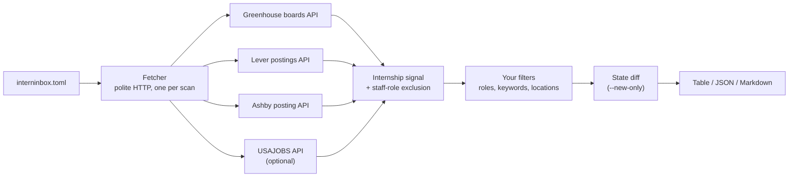

<div align="center">

<picture>
  <source media="(prefers-color-scheme: dark)" srcset="https://raw.githubusercontent.com/hiratinspace/interninbox/main/assets/logo-transparent.png">
  
</picture>

<h3>Find internships from your terminal. Zero API keys, nothing leaves your machine.</h3>

[](https://pypi.org/project/interninbox/)
[](https://pypi.org/project/interninbox/)
[](https://github.com/hiratinspace/interninbox/actions/workflows/ci.yml)
[](LICENSE)
[](#configuration)


</div>

List your target companies once, then get every matching internship from their
public job boards in one command. interninbox reads the documented public
board APIs of **Greenhouse**, **Lever**, **Ashby**, **SmartRecruiters**,
**Workable**, and **Recruitee**
(the same endpoints each company's own careers page calls). It can also read
the official **USAJOBS** API for federal Pathways internships.

## Why interninbox

- 🔒 **Private by design.** No accounts, no API keys, no LLMs, no telemetry. The only things ever written are your config and a local state file.
- 📍 **Search by location.** A country, a US state, or a city, with smart aliases: `"California"` finds boards that wrote `"CA"`, and vice versa.
- 🎯 **Search by role.** Nine curated presets (`software`, `cybersecurity`, `finance`, and more) or your own whole-word keywords.
- 🛂 **Filter by eligibility.** `require_sponsorship = true` hides listings known to not sponsor visas or to require US citizenship, read from list metadata and job descriptions. Season (`terms`) and degree filters too.
- 📋 **Scan the community lists.** `sources = ["simplify"]` pulls the SimplifyJobs seasonal list (thousands of curated internships across every employer, kept fresh by the community) in one polite request, and diffs it with `--new-only`.
- 🏢 **100+ curated companies.** Big and small, every slug live-verified. Scan your own list, or sweep a whole tier of the registry.
- 🧭 **First-run wizard.** No config? Answer three questions, get results, and optionally save them for next time.
- 📬 **A personal feed.** `--new-only` shows just what appeared since your last scan; run it on a schedule and it becomes your morning internship digest.
- 🤖 **Built for the AI era.** AI answers questions about internships; interninbox watches all of them. One command ([`interninbox mcp`](#use-interninbox-from-your-ai)) hands the whole scanner to Claude or any MCP-capable agent.
- 🤝 **Polite by construction.** Sequential, rate-limited requests, an honest User-Agent, documented public APIs only. No scraping.

## Install

```sh
pipx install interninbox      # recommended: isolated, on your PATH
uv tool install interninbox   # or with uv
uvx interninbox scan          # or zero-install, run it straight from PyPI
```

Requires **Python 3.11+**. Installing straight from git works too
(`pipx install git+https://github.com/hiratinspace/interninbox`), or run from a
checkout with `uv sync && uv run interninbox --help`.

### Updating

Already have an older version? Update it the same way you installed it:

```sh
pipx upgrade interninbox            # if you used pipx
uv tool upgrade interninbox         # if you used uv
pip install --upgrade interninbox   # if you used pip
```

Then check with `interninbox --version`. Upgrades are safe: your
`interninbox.toml` keeps working and the state file migrates itself. If an
upgrade insists you are already current but the version looks old, force it
with the installer's `--force` (pipx / uv tool) or `--force-reinstall` (pip).

## Quickstart

Everything in one line, no config, no setup (works with `uvx` too):

```sh
interninbox scan --role software --location "New York"
```

That scans the top tier of the [registry](#the-company-registry) for software
internships in New York and prints them. Swap in any [preset](#role-presets)
and place: `--role cybersecurity --location California`, `--role finance
--location "United States"`. Add `--company greenhouse:stripe` to point at your
own boards, `--source simplify` to fold in the [community list](#community-list-sources),
or `--registry all` to sweep every curated company.

Or just run it and answer a few questions:

```sh
interninbox scan
```

On a fresh terminal with no config, `scan` opens a short **wizard**. It asks
where you want to work, which role types, and which companies (your own list,
or a tier of the [registry](#the-company-registry) with a rough scan-time
estimate), scans immediately, and offers to save your answers to
`interninbox.toml` for next time. Blank answers mean "no preference." The
wizard only appears on a real terminal with no config; cron jobs and pipes are
never interrupted (pass `--interactive` to force it).

Prefer to set things up by hand?

```sh
interninbox init          # 1. write a starter interninbox.toml here
interninbox companies     # 2. print the curated registry to copy from
interninbox scan          # 3. scan every configured company
```

Edit `interninbox.toml` between steps 2 and 3, then re-run `interninbox scan`
whenever you want fresh results. Add `--new-only` to see only what's new since
your last scan.

## Commands

| Command | What it does |
| --- | --- |
| `interninbox scan` | Scan every configured company and print matching internships |
| `interninbox init` | Write a starter `interninbox.toml` (refuses to overwrite) |
| `interninbox companies` | Print the curated [registry](#the-company-registry) as ready-to-paste `ats:slug` entries, with each company's size and tags |
| `interninbox roles` | Print the [role presets](#role-presets) and the exact keywords each expands to |
| `interninbox find-board NAME` | Probe the supported ATSes for a company's board slug and print ready-to-paste `"ats:slug"` lines |
| `interninbox mcp` | Serve the scanner to [AI agents over MCP](#use-interninbox-from-your-ai) (JSON-RPC on stdin/stdout; meant for MCP clients, not for typing into) |
| `interninbox watch` | Re-scan on an interval in the foreground with a desktop notification per batch of new listings ([watch mode](#watch-mode); needs a terminal, cron users keep `scan --new-only`) |
| `interninbox --version` | Print the version |

### `scan` flags

| Flag | Effect |
| --- | --- |
| `--role PRESET`, `-r` | Only roles in this [preset](#role-presets) (repeatable). Overrides the config's `roles` |
| `--location PLACE`, `-l` | Only these locations: a country, US state, or city (repeatable). Overrides the config's `locations` |
| `--company ATS:SLUG` | Scan this board, e.g. `greenhouse:stripe` (repeatable). Overrides the config's `companies` |
| `--registry TIER` | Also sweep a registry tier (`none`, `top`, `all`, `large`, `startups`). Overrides the config |
| `--source NAME` | Also scan a [community list](#community-list-sources), e.g. `simplify` (repeatable). Overrides the config's `sources` |
| `--config PATH` | Use a config other than `./interninbox.toml` |
| `--json` | Emit machine-readable JSON instead of the table |
| `--markdown` | Emit a Markdown table (paste it anywhere) |
| `--new-only` | Show only listings not seen by a previous scan |
| `--state PATH` | Use a state file other than the one derived from the config name |
| `--interactive` | Ask location/role/company questions before scanning (automatic on a terminal when no config exists). With an existing config, the answers apply to that run only unless you save them: a one-shot override of `locations`, `roles`, and `registry` that leaves everything else untouched |
| `--since WINDOW` | Show only listings posted within the window (`7d`, `36h`, `2w`); undated listings are kept |
| `--quiet`, `-q` | Suppress the banner and per-company progress lines |

An interactive scan opens with the block wordmark ("intern" in white,
"inbox" in blue, matching the logo), then prints per-company progress:

```text
██        ██                            ██        ██
          ██                                      ██
██ ██████ ██▀▀▀▀ ██████ ██▀▀██ ██████   ██ ██████ ██████ ██████ ██  ██
██ ██  ██ ██     ██▄▄██ ██     ██  ██   ██ ██  ██ ██  ██ ██  ██  ▀██▀
██ ██  ██ ██     ██     ██     ██  ██   ██ ██  ██ ██  ██ ██  ██  ▄██▄
██ ██  ██  ▀████ ██████ ██     ██  ██   ██ ██  ██ ██████ ██████ ██  ██

  > find internships. in the terminal.
```

It goes to `stderr` (never `stdout`), so piped `--json` / `--markdown` output
stays clean. It appears only on a real terminal, honors `NO_COLOR`, uses a
theme-proof 256-color blue, and vanishes under pipes, redirects, and cron.
Pass `--quiet` to silence it (and the progress lines) anywhere. On a real
terminal, each result's URL is a clickable OSC 8 hyperlink.

Exit codes: `0` on success (a single company that fails prints a one-line
warning and never aborts the scan); `1` when the config is invalid or every
company failed.

## Configuration

`interninbox init` writes this file; every key is explained inline.

```toml
# Target companies as "ats:slug".
companies = [
    "greenhouse:stripe",   # job-boards.greenhouse.io/<slug>
    "lever:plaid",         # jobs.lever.co/<slug>
    "ashby:linear",        # jobs.ashbyhq.com/<slug>
]

# Also sweep the bundled curated registry: "none" (default), "top" (~50
# well-known boards), "all", "large", or "startups". Unioned with `companies`.
registry = "none"

# Community internship lists to scan too ("simplify" = the SimplifyJobs
# seasonal list; one polite request for thousands of curated internships).
sources = ["simplify"]

[filters]
# Extra title keywords that count as an internship signal, on top of the
# built-in one (intern, internship, co-op, summer analyst, apprentice, ...).
include_keywords = []

# Named role presets that narrow to a field. Run `interninbox roles` to list
# them. Their keywords merge into match_keywords. Example: roles = ["cybersecurity"].
roles = []

# Drop any listing whose title contains one of these (case-insensitive).
exclude_keywords = ["mechanical"]

# Keep only listings whose location contains one of these as a whole word
# (case-insensitive). Empty = keep every location.
locations = ["New York", "Remote"]

# When true (the default), remote listings always pass the locations filter.
remote_ok = true

# Hide listings KNOWN to not sponsor visas or to require US citizenship.
# Silent listings are always kept.
require_sponsorship = true

# Keep only these seasons / degree levels (unknown always passes).
terms = ["Summer 2027"]
degrees = ["Bachelor's"]

# Optional: federal Pathways internships via the official USAJOBS API.
[usajobs]
enabled = true
email = "you@example.com"        # the email your API key is registered under
keywords = ["software"]
api_key_env = "USAJOBS_API_KEY"  # environment variable holding your key
```

| Key | Type | Default | Meaning |
| --- | --- | --- | --- |
| `companies` | list of `"ats:slug"` | required unless `registry`/`[usajobs]` is set | Boards to scan; `ats` is `greenhouse`, `lever`, `ashby`, `smartrecruiters`, `workable`, `recruitee`, or `website` (slug = a bare domain, see [Scanning a company website](#scanning-a-company-website)) |
| `registry` | `"none"`, `"top"`, `"all"`, `"large"`, `"startups"` | `"none"` | Also scan the curated [registry](#the-company-registry); unioned with `companies` (duplicates removed) |
| `sources` | list of strings | `[]` | [Community lists](#community-list-sources) to scan too: `"simplify"` (current season) or `"simplify-summer2026"` / `"simplify-summer2027"` to pin one |
| `filters.include_keywords` | list of strings | `[]` | Extra title keywords OR-ed with the built-in internship signal (broadens) |
| `filters.match_keywords` | list of strings | `[]` | Whole-word title keywords required on top of the signal (narrows) |
| `filters.roles` | list of strings | `[]` | Named [role presets](#role-presets) whose keywords merge into `match_keywords` |
| `filters.exclude_keywords` | list of strings | `[]` | Title substrings that drop a listing |
| `filters.locations` | list of strings | `[]` | Whole-word location terms to keep; empty keeps everything |
| `filters.remote_ok` | bool | `true` | Whether remote listings bypass the locations filter |
| `filters.require_sponsorship` | bool | `false` | Hide listings [known](#eligibility-filters) to not sponsor visas or to require US citizenship |
| `filters.terms` | list of strings | `[]` | Keep only these seasons (e.g. `["Summer 2027"]`); unknown passes |
| `filters.degrees` | list of strings | `[]` | Keep only these degree levels (e.g. `["Bachelor's"]`); unknown passes |
| `usajobs.enabled` | bool | `false` | Turn the USAJOBS adapter on |
| `usajobs.email` | string | none | The email your USAJOBS key is registered under |
| `usajobs.keywords` | list of strings | `[]` | Extra keyword filter for the USAJOBS query |
| `usajobs.api_key_env` | string | `"USAJOBS_API_KEY"` | Environment variable holding your key |

A commented copy ships as
[`interninbox.example.toml`](interninbox.example.toml).

### Finding a company's slug

Open a company's careers page and read the URL of an actual job listing:

| You see | Add to your config |
| --- | --- |
| `job-boards.greenhouse.io/acme/...` | `"greenhouse:acme"` |
| `jobs.lever.co/acme/...` | `"lever:acme"` |
| `jobs.ashbyhq.com/acme/...` | `"ashby:acme"` |
| `jobs.smartrecruiters.com/AcmeCorp/...` | `"smartrecruiters:AcmeCorp"` |
| `apply.workable.com/acme/j/...` | `"workable:acme"` |
| `acme.recruitee.com/o/...` | `"recruitee:acme"` |
| any other careers site | `"website:careers.acme.com"` (the page's own domain) |

Or let the tool guess: `interninbox find-board "Acme Corp"` probes all six
ATSes with the obvious slug candidates and prints whatever answers. If a scan
reports `HTTP 404 from <host>: check the slug exists`, the slug is wrong or
the company changed ATS providers. `interninbox companies` lists the full
registry of known-good entries to start from.

### Scanning a company website

Companies without a supported ATS often still publish their jobs as
machine-readable structured data for search engines. `website:<domain>` reads
exactly that public surface, no private APIs and no HTML scraping:

1. **robots.txt** is fetched first with the tool's honest User-Agent. Pages it
   disallows are skipped (and counted in a warning); if robots.txt itself
   cannot be read (a 403, say), the whole site is refused, because scanning
   without permission would be impolite.
2. **Sitemaps** named in robots.txt (or `/sitemap.xml` as the fallback) are
   walked for job-looking URLs, with hard caps: at most 20 child sitemaps,
   two levels of sitemap-index nesting, and at most 200 page fetches per site
   per scan, each cap announced honestly when hit.
3. **JSON-LD `JobPosting` blocks** embedded in each page (the schema.org data
   sites publish for Google Jobs) become listings: title, location, posted
   date, and the description feeds the same sponsorship classifier as every
   other adapter. Postings past their `validThrough` date are dropped.

Results are cached per site, keyed by sitemap `lastmod`, so rescans refetch
only changed pages. Sequential polite pacing still applies: a first scan of a
big site takes a few minutes by design.

Limits worth knowing: sites that render jobs purely client-side (for example
lifeattiktok.com, jobs.bytedance.com, most iCIMS tenants) publish no
server-side JSON-LD and yield nothing; sites that block automated requests
(www.tesla.com) or disallow crawling in robots.txt are respected and skipped.
Workday-hosted boards (`something.wd1.myworkdayjobs.com`) and WordPress-style
career sites generally work end to end:

```toml
companies = ["website:psu.wd1.myworkdayjobs.com"]
```

## How matching works

All matching is local, deterministic heuristics that are fast, free, and
predictable:

1. **Internship signal.** Word-boundary regexes on the title (`intern`, `internship`, `co-op`, `summer analyst`, `apprentice`, `student trainee`, and friends), OR any of your `include_keywords`. Word boundaries matter: *"International Program Manager"* and *"Internal Tools Engineer"* do **not** match.
2. **`match_keywords` / `roles` requirement.** If set, the title must also contain one of them as a whole word. This *narrows* ("internship AND security"); `include_keywords` *broadens*.
3. **Staff-role exclusion.** Roles *about* interns rather than *for* them (recruiter, program manager) and seniority markers (Senior, Staff, II/III) are dropped.
4. **Your filters.** `exclude_keywords`, then `locations` / `remote_ok`.

A listing with no stated location is **dropped** when `locations` is set (there
is nothing to match against). Leave `locations = []` to keep such listings.

**Location matching** is whole-word and case-insensitive: `"NY"` matches
"Albany, **NY**" but not "Su**nny**vale, CA". Common US-state and country
forms are expanded for you, so `"California"` also matches `"CA"`, and
`"NYC"` ⇄ `"New York"`, `"UK"` ⇄ `"United Kingdom"`, `"US"`/`"USA"` ⇄
`"United States"`. Two safety rules keep the short forms honest:

- A full state name expands to its **comma-anchored** code (`"Oregon"` → `", OR"`), never the bare code, so `"Oregon"` matches "Portland, OR" but never the word *or* in "Remote in USA **or** Canada" (the same anchor protects `IN`, `ME`, `OK`, `HI`, and the pronoun-safe `US`).
- `"LA"` deliberately means **Louisiana only**; for Los Angeles, spell it out.

## Role presets

Narrow to a whole field with a named preset instead of hand-listing keywords:

```toml
[filters]
roles = ["cybersecurity"]   # keeps only security internships
```

Run `interninbox roles` to see every preset and the exact whole-word keywords
it expands to: `software`, `data`, `cybersecurity`, `finance`, `business`,
`marketing`, `design`, `product`, and `hardware`. A preset's keywords merge
into `match_keywords` (both mean "titles I want to see"), so `roles =
["software"]` keeps titles containing "software", "backend", "platform", and
friends. Nothing is magic: the command prints the keywords, and an unknown
role name fails with the list of valid ones.

## The company registry

interninbox bundles a curated registry of 100+ internship-hiring companies
across Greenhouse, Lever, and Ashby: a mix of large public companies and
startups, each tagged by industry. Every slug was **live-verified** against its
public board API when the registry was authored
([`scripts/verify_registry.py`](scripts/verify_registry.py)); companies do
migrate ATSes, so a slug that later goes stale degrades gracefully (one warning
line) rather than crashing a scan.

Sweep a tier without listing companies by hand:

```toml
registry = "top"   # ~50 of the most-recognized boards
```

| Tier | What it scans |
| --- | --- |
| `"top"` | ~50 of the most-recognized companies |
| `"all"` | the whole registry |
| `"large"` | only the large / public companies |
| `"startups"` | only the startups |

The tier is **unioned** with any `companies` you list (duplicates removed).
Big sweeps are slow *on purpose*: polite pacing floors same-host requests at
500 ms, so a scan of 20+ boards prints an honest estimate up front (e.g.
`scanning 103 boards, roughly ~2 min`).

**Contributing an entry:** add a `RegistryCompany(ats, slug, name, size,
tags)` row to `src/interninbox/registry.py`, then run
`scripts/verify_registry.py`. It must report a live `PASS` (HTTP 200) before
the entry ships. Never commit an unverified slug.

## Community list sources

The broadest coverage comes from the community: the
[SimplifyJobs seasonal internship lists](https://github.com/SimplifyJobs/Summer2027-Internships)
track thousands of internships across *every* employer, including companies
on ATSes this tool has no adapter for, and publish the data behind their
README as structured JSON. Add the list as a source:

```toml
sources = ["simplify"]
```

One polite request fetches the whole list; entries arrive with sponsorship,
season, and degree metadata that feeds the
[eligibility filters](#eligibility-filters). Your keyword, role, and location
filters apply to list entries exactly as they do to scanned boards, and
`--new-only` diffs the list run over run, so the terminal becomes a feed over
the list students refresh by hand. `"simplify"` follows the current season;
pin `"simplify-summer2026"` or `"simplify-summer2027"` to a specific one.

List data is community-maintained (credit: SimplifyJobs and contributors) and
links out to each employer's own posting; interninbox never scrapes those
hosts. A source that is unreachable degrades to one warning line and the rest
of the scan continues.

## Eligibility filters

The questions that actually disqualify an application get first-class
filters:

```toml
[filters]
require_sponsorship = true   # for international students
terms = ["Summer 2027"]
degrees = ["Bachelor's"]
```

- **`require_sponsorship = true`** hides listings *known* to not sponsor
  visas or to require US citizenship. Signals come from community-list
  metadata and from the job description itself: Lever, Ashby, and Recruitee
  include descriptions in their normal responses, and Greenhouse and Workable
  descriptions are fetched (only when this filter is on, since they inflate
  each board fetch).
  Classification is requirement-aware and sentence-scoped: "unable to
  sponsor", "must not require sponsorship", "US citizenship is required", and
  clearance/ITAR *requirements* disqualify, while hedged mentions ("clearance
  preferred", "no sponsorship required") never do. A listing that says
  nothing is **always kept**. USAJOBS listings count as citizenship-restricted
  (federal Pathways positions are citizenship-limited). SmartRecruiters
  postings carry no descriptions in the list API, so they stay unknown and
  are always kept; the phrase lists are English-only, so non-English boards
  also stay unknown.
- **`terms`** keeps only the seasons you want, read from list metadata or
  the title ("... Intern (Summer 2027)"). Unknown seasons pass.
- **`degrees`** keeps only listings open to your level (list-source entries
  carry this metadata). Unknown passes.

The same data flows into `--json` output as `sponsorship` and `terms` fields
on every listing, so scripts can post-process it. Each verdict also carries a
`sponsorship_evidence` field showing where it came from: the description
sentence that triggered it (trimmed to 160 characters), the list's own
metadata value (like `list: "Does Not Offer Sponsorship"`), or
`federal Pathways position` for USAJOBS. Unknown verdicts have no evidence.

## `--new-only` and the state file

Every scan records what it saw in a small state file next to your config.
With `--new-only`, only listings absent from that file are shown, so "new"
always means **"since my last scan"**, whether or not earlier scans used the
flag. A listing counts as *seen* once it has been fetched, even if your filters
hid it, so loosening a filter later won't flood `--new-only` with old posts.

- First scan: everything is new. Missing or corrupt state file: everything counts as new (one warning, never a crash).
- Each config gets its own state file (`interninbox.toml` → `.interninbox-state.json`, `work.toml` → `.interninbox-state.work.json`), so two configs in one directory don't share state. Override with `--state PATH`.
- The file stores only a listing key and the date it was last seen (no URLs); entries not seen for a year are pruned, so it never grows without bound.
- `init` writes only the TOML; if your config lives in a git repo, add `.interninbox-state.json` to your `.gitignore` yourself.

Run it on a schedule (cron, launchd, a shell alias) and `--new-only` becomes a
personal internship feed. Prefer a terminal that watches itself? That is
[watch mode](#watch-mode).

## Watch mode

`interninbox watch` closes the freshness loop: it runs the same scan as
`scan --new-only` in a foreground loop, prints one timestamped line per cycle,
shows new listings as the usual table, and sends a desktop notification per
non-empty batch ("interninbox: 2 new internships"). State is shared with
`scan`, so a watch picks up exactly where your last scan left off, and a later
`scan --new-only` knows what watch already showed you.

```sh
interninbox watch                  # check every 30 minutes
interninbox watch --interval 2h    # or on your own schedule
interninbox watch --no-notify      # per-cycle lines and tables only
```

| Flag | Effect |
| --- | --- |
| `--interval WINDOW` | Time between checks (`30m`, `2h`, `1d`; default `30m`, hard floor `15m`) |
| `--no-notify` | Skip desktop notifications; keep the per-cycle lines and tables |
| `--config PATH`, `--state PATH` | Same meaning as for `scan` |

Notifications are best effort: `osascript` on macOS, `notify-send` on Linux, a
PowerShell toast on Windows, and a missing or broken notifier never interrupts
the loop. Stop with Ctrl-C.

Politeness does not bend for watch. Every cycle goes through the same
sequential, rate-limited fetcher as a one-shot scan, and the interval has a
hard floor of 15 minutes (`--interval 5m` is refused with an explanation): job
boards do not change more often than that, and neither should your traffic.
This is local polling, not a push feed, and interninbox is honest about it.

Watch is a foreground loop for a real terminal, not a daemon; without a
terminal it exits and points you here. For unattended schedules (servers,
cron, launchd), `interninbox scan --new-only` does the same diff without the
loop:

```
*/30 * * * * cd ~/internships && interninbox scan --new-only --quiet
```

## Use interninbox from your AI

`interninbox mcp` serves the scanner to AI agents over the
[Model Context Protocol](https://modelcontextprotocol.io): newline-delimited
JSON-RPC on stdin/stdout, nothing else on either stream. Register it with
Claude Code in one command:

```sh
claude mcp add interninbox -- interninbox mcp
```

Then ask in plain language ("any new software internships in New York this
week that sponsor visas?") and the agent runs real scans on your machine.
The server exposes three tools:

| Tool | What it exposes |
| --- | --- |
| `scan_internships` | The same scan core as the CLI. Parameters mirror the config file: `roles`, `locations`, `terms`, `require_sponsorship`, `registry` tier, `sources`, extra `companies` as `ats:slug`, a `since` window, and a result `limit`. Returns listings in the `--json` shape, including `sponsorship_evidence`, the sentence behind every visa verdict, so the agent can cite its source |
| `list_role_presets` | The named [role presets](#role-presets) and the exact keywords each expands to |
| `find_board` | Probes the supported ATSes for a company's board slug, ready to feed back into `scan_internships` |

The politeness rules do not bend for agents: every tool call goes through the
same sequential, rate-limited fetcher as a normal scan, with no API keys and
no telemetry. MCP scans are also stateless by design: they never read or
write your `--new-only` state file, so an agent poking around can never eat
the listings from your personal feed. Any MCP-capable client works, not just
Claude; point it at the `interninbox mcp` command over stdio.

## USAJOBS (optional)

Federal Pathways internships come from the official USAJOBS Search API, which
needs a free key:

1. Request one at <https://developer.usajobs.gov/apirequest/>.
2. Export it: `export USAJOBS_API_KEY=...`.
3. Set `[usajobs] enabled = true` and `email = "..."`.

Per USAJOBS's documented contract, requests must carry the registered email as
the User-Agent; interninbox sends exactly that, for that host only. If
`[usajobs]` is enabled but the key variable is unset, the scan skips it with an
info line and carries on.

## How a scan works



Politeness is enforced in one place (`src/interninbox/fetch.py`) that every
adapter goes through, so it is not a setting you can forget: sequential
requests, ≥500 ms between same-host calls, a 15-second timeout, at most one
retry (on transient failures only), and an honest User-Agent. Only documented
public APIs are used, with no HTML scraping and nothing behind a login.

## Scope, honestly

This tool does **local scans**: one-shot with `scan`, or on a polite loop with
a 15 minute floor with [`watch`](#watch-mode). That is its whole job, done
politely and fast. It deliberately does *not* verify a listing is still live,
deduplicate reposts across boards, run as a background daemon, or apply for
you.

Title-only matching also misses some real internships: bare "Trainee", titles
like "Software Engineer (Intern) II" (the seniority filter wins), and languages
beyond the built-in German/French patterns. `include_keywords` can widen the
net. Continuous verification, curation, and instant push alerts are what the
hosted Interninbox product (coming soon) does. This CLI is the honest local
version: you run it, you own your data, and nothing phones home.

## FAQ

**Why these ATSes?** Greenhouse, Lever, Ashby, SmartRecruiters, Workable, and
Recruitee expose
documented public board APIs designed for exactly this, and the community
list covers employers on everything else. PRs welcome for any source with a
documented public API.

**Does it store or send my data anywhere?** No. The only writes are your config
and the local state file. There is no telemetry of any kind.

**A company I added returns 404.** The slug is wrong or the company changed ATS
providers. See [Finding a company's slug](#finding-a-companys-slug).

**Can it email or notify me?** Desktop notifications, yes: that is
[watch mode](#watch-mode). Email is not built in; pipe `--json` into whatever
you like, or run `scan --new-only` on a schedule with a mail hook.

## Development

```sh
uv sync
uv run pytest        # the full offline suite (MockTransport + synthetic fixtures)
uv run ruff check .
```

Every test is offline, with no recorded third-party data, ever
([provenance note](tests/fixtures/README.md)). Source lives in
`src/interninbox/` (adapters, filters, fetcher, registry, wizard, CLI).
Support is best-effort via GitHub issues; see
[CONTRIBUTING.md](CONTRIBUTING.md).

## License

[MIT](LICENSE) © 2026 Interninbox contributors
