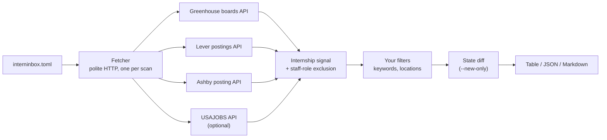

<div align="center">

# interninbox-cli

**Find internships from your terminal.**

List your target companies once — get every matching internship from their
public job boards, in one command, on your machine.

[](https://github.com/hiratinspace/interninbox-cli/actions/workflows/ci.yml)
[](LICENSE)
[](pyproject.toml)
[](#configuration)

</div>

```console
$ interninbox scan --new-only

COMPANY   TITLE                                   LOCATIONS       POSTED      URL
stripe    Software Engineering Intern (Summer)    New York, NY    2026-08-01  https://stripe.com/jobs/...
linear    Product Engineering Intern              Remote          2026-07-28  https://jobs.ashbyhq.com/linear/...
plaid     Data Science Intern                     San Francisco   -           https://jobs.lever.co/plaid/...

3 internships across 3 companies
```

**No accounts. No API keys. No LLMs. Nothing leaves your machine.**
It reads the documented public job-board APIs of **Greenhouse**, **Lever**, and
**Ashby** — the same endpoints each company's own careers page calls — plus,
optionally, the official **USAJOBS** API for federal Pathways internships.

---

## Contents

- [Install](#install)
- [Quickstart](#quickstart)
- [Commands](#commands)
- [Configuration](#configuration)
- [Finding a company's slug](#finding-a-companys-slug)
- [How matching works](#how-matching-works)
- [`--new-only` and the state file](#--new-only-and-the-state-file)
- [USAJOBS (optional)](#usajobs-optional)
- [How a scan works](#how-a-scan-works)
- [Politeness, built in](#politeness-built-in)
- [Scope, honestly](#scope-honestly)
- [FAQ](#faq)
- [Development](#development)

---

## Install

With **pipx** (recommended — isolated, on your PATH):

```sh
pipx install git+https://github.com/hiratinspace/interninbox-cli
```

With **uv**:

```sh
uv tool install git+https://github.com/hiratinspace/interninbox-cli
```

Or run from a checkout:

```sh
git clone https://github.com/hiratinspace/interninbox-cli
cd interninbox-cli
uv sync
uv run interninbox --help
```

Requires Python 3.11+. PyPI publication is planned — after that,
`pipx install interninbox-cli` will work directly.

## Quickstart

Sixty seconds, three commands:

```sh
interninbox init          # 1. writes a starter interninbox.toml here
interninbox companies     # 2. prints 34 well-known companies to copy from
interninbox scan          # 3. scans every configured company
```

Edit `interninbox.toml` between steps 2 and 3 — add the companies you care
about, tighten the filters if you like, and re-run `interninbox scan` whenever
you want fresh results. Add `--new-only` to see only what appeared since your
last scan.

## Commands

| Command | What it does |
| --- | --- |
| `interninbox init` | Write a starter `interninbox.toml` into the current directory (refuses to overwrite) |
| `interninbox scan` | Scan every configured company and print matching internships |
| `interninbox companies` | Print a starter list of well-known companies as ready-to-paste `ats:slug` entries |
| `interninbox --version` | Print the version |

### `scan` flags

| Flag | Effect |
| --- | --- |
| `--config PATH` | Use a config other than `./interninbox.toml` |
| `--json` | Emit machine-readable JSON instead of the table |
| `--markdown` | Emit a Markdown table (paste it anywhere) |
| `--new-only` | Show only listings not seen by a previous scan |
| `--state PATH` | Use a state file other than `.interninbox-state.json` next to the config |

Exit codes: `0` on success (including partial failures — a company that fails
prints a one-line warning and never aborts your scan), `1` when the config is
invalid or every company failed.

## Configuration

`interninbox init` writes this file; every key explained:

```toml
# Target companies as "ats:slug".
companies = [
    "greenhouse:stripe",   # job-boards.greenhouse.io/<slug>
    "lever:plaid",         # jobs.lever.co/<slug>
    "ashby:linear",        # jobs.ashbyhq.com/<slug>
]

[filters]
# Extra title keywords that count as an internship signal, in addition to
# the built-in one (intern, internship, co-op, summer analyst, apprentice,
# student trainee, ...).
include_keywords = []

# Drop any listing whose title contains one of these (case-insensitive).
exclude_keywords = ["mechanical"]

# Keep only listings whose location contains one of these substrings
# (case-insensitive). Empty = keep every location.
locations = ["New York", "Remote"]

# When true (the default), remote listings always pass the locations filter.
# When false, remote-only listings are dropped.
remote_ok = true

# Optional: federal internships (Pathways program) via the official
# USAJOBS API — see the USAJOBS section below.
[usajobs]
enabled = true
email = "you@example.com"        # the email your API key is registered under
keywords = ["software"]
api_key_env = "USAJOBS_API_KEY"  # environment variable holding your key
```

| Key | Type | Default | Meaning |
| --- | --- | --- | --- |
| `companies` | list of `"ats:slug"` | — (required) | Boards to scan; `ats` is `greenhouse`, `lever`, or `ashby` |
| `filters.include_keywords` | list of strings | `[]` | Extra title keywords OR-ed with the built-in internship signal |
| `filters.exclude_keywords` | list of strings | `[]` | Title substrings that drop a listing |
| `filters.locations` | list of strings | `[]` | Location substrings to keep; empty keeps everything |
| `filters.remote_ok` | bool | `true` | Whether remote listings bypass the locations filter |
| `usajobs.enabled` | bool | `false` | Turn the USAJOBS adapter on |
| `usajobs.email` | string | — | The email your USAJOBS key is registered under |
| `usajobs.keywords` | list of strings | `[]` | Extra keyword filter passed to the USAJOBS query |
| `usajobs.api_key_env` | string | `"USAJOBS_API_KEY"` | Name of the environment variable holding your key |

A commented copy ships as
[`interninbox.example.toml`](interninbox.example.toml).

## Finding a company's slug

Open the company's careers page and look at the URL of an actual job listing:

| You see | Add to your config |
| --- | --- |
| `job-boards.greenhouse.io/acme/...` | `"greenhouse:acme"` |
| `boards.greenhouse.io/acme/...` | `"greenhouse:acme"` |
| `jobs.lever.co/acme/...` | `"lever:acme"` |
| `jobs.ashbyhq.com/acme/...` | `"ashby:acme"` |

If a scan reports `HTTP 404 — check the slug exists`, the slug is wrong or the
company moved ATS providers. `interninbox companies` gives you 34 known-good
entries to start from.

## How matching works

All matching is local, deterministic heuristics — fast, free, and predictable:

1. **Internship signal** — word-boundary regexes on the title: `intern`,
   `internship`, `co-op`, `summer analyst`, `apprentice`, `student trainee`,
   and friends, OR any of your `include_keywords`. Word boundaries matter:
   *"International Program Manager"* and *"Internal Tools Engineer"* do **not**
   match.
2. **Staff-role exclusion** — roles *about* interns rather than *for* them
   (recruiter, program manager, university relations) and unambiguous
   seniority markers (Senior, Staff, II/III) are dropped.
3. **Your filters** — `exclude_keywords`, then `locations`/`remote_ok`.

A listing with no stated location passes the locations filter (boards often
omit location metadata; dropping those silently would hide real internships).

## `--new-only` and the state file

Every scan records what it saw in a small state file
(`.interninbox-state.json`, next to your config; override with `--state`).
With `--new-only`, only listings absent from that file are shown — so "new"
always means **"since my last scan"**, whether or not earlier scans used the
flag.

- First scan: everything is new.
- Missing or corrupt state file: everything counts as new — one warning,
  never a crash.
- The state file is per-config-location and gitignored by `init`'s
  convention; delete it any time to reset.

Run it on a schedule (cron, launchd, a shell alias you hit with your morning
coffee) and `--new-only` becomes a personal internship feed.

## USAJOBS (optional)

Federal Pathways internships come from the official USAJOBS Search API, which
requires a free key:

1. Request one at <https://developer.usajobs.gov/apirequest/>.
2. Export it: `export USAJOBS_API_KEY=...` (or point `api_key_env` at your
   preferred variable).
3. Set `[usajobs] enabled = true` and `email = "..."`.

Per USAJOBS's documented API contract, requests to it must carry the
registered email as the User-Agent — this tool sends exactly that, for that
host only. If `[usajobs]` is enabled but the key variable is unset, the scan
skips it with an info line and carries on.

## How a scan works



## Politeness, built in

Being a good citizen is enforced in one place (`src/interninbox/fetch.py`)
that every adapter goes through — it is not a setting you can forget:

- Requests run **sequentially**, with at least **500 ms** between any two
  requests to the same host.
- **15-second timeout**, at most **one retry**, and only on transient
  failures (network errors, 5xx).
- Every request carries an honest User-Agent:
  `interninbox-cli/<version> (+https://github.com/hiratinspace/interninbox-cli)`.
- Only **documented public APIs** are used — the same endpoints the
  companies' own careers pages call. No HTML scraping, no automation of
  anything behind a login.

## Scope, honestly

This tool does **one-shot local scans** — that's its whole job, and it does it
politely and fast. What it deliberately does *not* do:

- verify a listing is still live (boards keep stale posts around),
- deduplicate reposts across boards,
- watch continuously or alert you the moment something appears,
- apply on your behalf.

Continuous verification, curation, and instant alerts are what the hosted
Interninbox product (coming soon) does. This CLI is the honest local version:
you run it, you own your data, nothing phones home.

## FAQ

**Why only Greenhouse, Lever, and Ashby?**
They expose documented public board APIs designed for exactly this. Support
for more sources may come — PRs welcome if the source has a documented public
API.

**Does it store or send my data anywhere?**
No. The only writes are your config and the local state file. There is no
telemetry of any kind.

**A company I added returns 404.**
The slug is wrong or the company changed ATS providers — see
[Finding a company's slug](#finding-a-companys-slug).

**Can it email/notify me?**
Not built in — pipe `--json` into whatever you like, or run it on a schedule
with `--new-only` and a mail hook.

## Development

```sh
uv sync
uv run pytest          # 102 tests, all offline (MockTransport + synthetic fixtures)
uv run ruff check .
```

Layout: `src/interninbox/` (adapters, filters, fetcher, CLI),
`tests/` with authored synthetic fixtures for fictional companies — no
recorded third-party data, ever ([provenance note](tests/fixtures/README.md)).

Support is best-effort via GitHub issues — see
[CONTRIBUTING.md](CONTRIBUTING.md).

## License

[MIT](LICENSE) © 2026 Interninbox contributors
